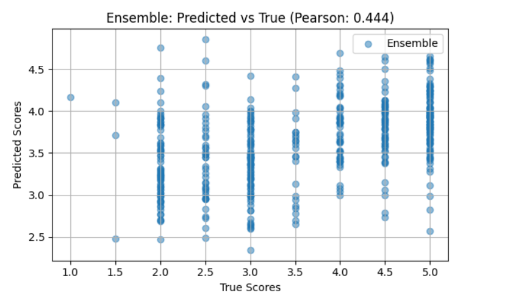

<h1 align="center">Grammar Scoring Engine for Voice Samples</h1>

  <h4>Evaluate spoken grammar using machine learning and voice features</h4> 

# Overview
This project focuses on predicting Mean Opinion Score (MOS) grammar ratings from spoken English audio samples using machine learning techniques. The goal is to build a robust and accurate system for scoring grammar quality (Likert scale: 0 to 5) based on features extracted from 45–60 second voice recordings.

This system has applications in automated English proficiency tests, education tech platforms, and speech analytics for learners. Given the complexity of human speech, various features such as linguistic richness, fluency, and accuracy are indirectly captured through acoustic and language model embeddings.

# 📁 File Contents

  • shl.ipynb – Main notebook containing:
  
  • Data import and exploration
  
  • Preprocessing steps
  
  • Model training and evaluation
  
  • Visualizations and result interpretations
  
# 📁Dataset Description
The dataset consists of audio files and corresponding CSV metadata files. 
•🔊 Audio Files

     Format: .wav

     Each file contains a short speech sample.

•📄 CSV Files

    train.csv:
    
    Contains file names and corresponding grammar score labels for training.

    test.csv:
    
    Contains only file names for testing. Labels are not included.
    
📊 Data Split

  Training Samples: 444

  Testing Samples: 195

# 🔍 1. Data Import and Exploration
  • Libraries Imported:
    
  pandas, whisper (OpenAI), librosa, sentence-transformers, scikit-learn, xgboost, lightgbm, matplotlib, tqdm.

  • Whisper Model:
    
  The small variant of OpenAI's Whisper is used for automatic audio transcription

# 🧹 2. Preprocessing Steps
  • Audio Transcription:
  
  Each audio file is transcribed to text using Whisper:
  
  Transcriptions are stored as a new column: train_df["transcript"]

  • Text Embedding:
  
  Transcribed texts are converted to numerical vectors using Sentence-BERT

# 🤖 3. Model Training and Evaluation
  • Target Variable:
  
    y_train = train_df["label"].values (Likely regression, not classification)
  
  • Models Used:
  
    Ridge Regression
  
    XGBoost Regressor
  
    LightGBM Regressor
  
    Ensemble Method:
    
  A VotingRegressor combines all three
    
 • Evaluation Metric:
 
  Pearson correlation coefficient is used to evaluate the predictions from cross-validation
  
# 📊 4. Visualizations and Result Interpretations
• Scatter Plot:

  A scatter plot is generated to compare predicted vs actual labels

  
  
  
• Interpretation:

  High correlation indicates model effectiveness in capturing the target variable from transcribed speech.

# 📁 Output Artifacts

Transcribed text for each audio file

Sentence embeddings

Trained ensemble model (in memory)

Pearson correlation score

Diagnostic plots

# Conclusion
The model achieved a **Pearson Correlation of ~0.44** on the validation set using XGBoost and other Models. This shows promising potential in scoring grammar objectively from speech. The pipeline can be extended using deep learning or ensemble techniques for further improvement.
